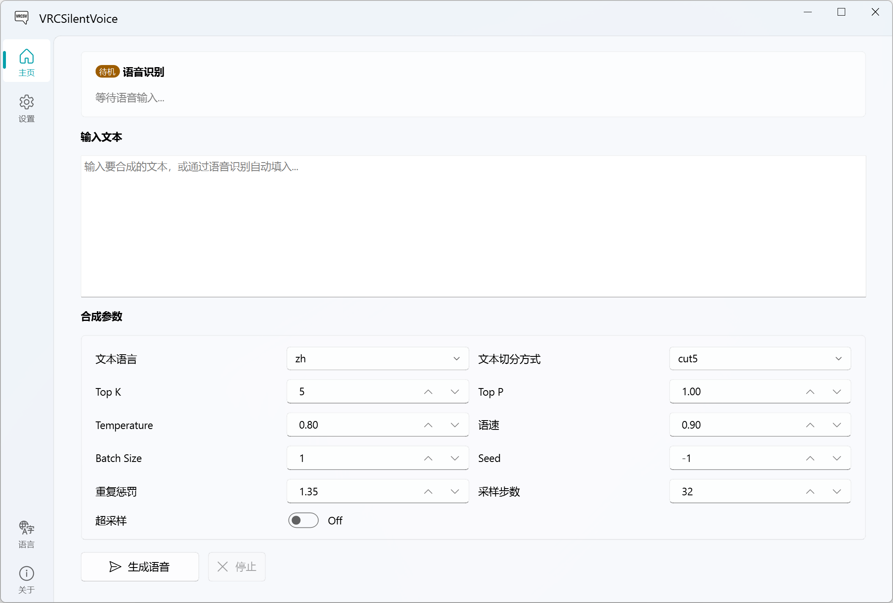
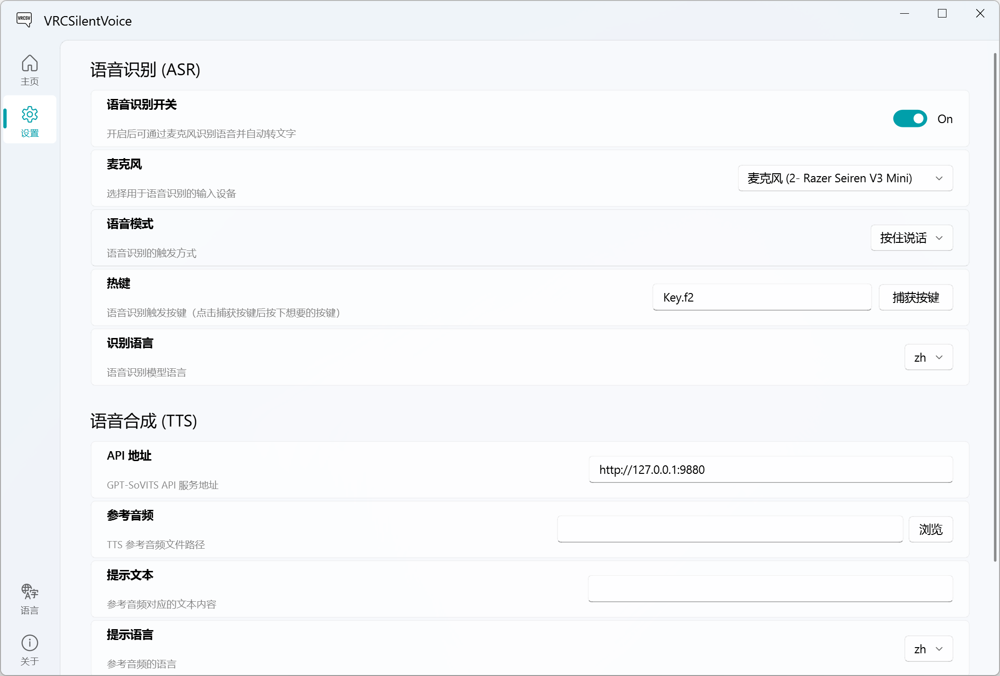

<p align="center">
  
</p>

<h1 align="center">VRC Silent Voice</h1>

<p align="center">
  <b>A voice synthesis tool for mute players in VRChat</b>
</p>

<p align="center">
  <a href="#features">Features</a> •
  <a href="#getting-started">Getting Started</a> •
  <a href="#installation">Installation</a> •
  <a href="#usage">Usage</a> •
  <a href="#tech-stack">Tech Stack</a>
</p>

<p align="center">
  <a href="../README.md">中文</a> | English
</p>

---

## What is this?

In VRChat, there are players who choose not to use their real voice to communicate — they are known as **mute players**. Whether it's due to social anxiety, privacy concerns, voice dysphoria, or simply preferring not to use their own voice.

**VRC Silent Voice** is built for them. It lets you communicate freely in VRChat using **a voice you love**:

1. Speak into your microphone (or just type)
2. Offline speech recognition automatically converts your voice to text
3. GPT-SoVITS synthesizes the text into your desired voice
4. The synthesized voice plays in VRChat via a virtual audio cable

**Your voice, defined by you.**

## Features

- **Offline Speech Recognition (ASR)** — Powered by Sherpa-ONNX, fully offline, privacy-safe, supports Chinese / English / Japanese / Korean
- **High-Quality Voice Synthesis (TTS)** — Powered by GPT-SoVITS V2 API, clone any voice with just a few seconds of reference audio
- **VRChat OSC Chatbox** — Recognized text is automatically sent to VRChat's in-game chatbox, with a typing indicator while speaking
- **Dual-Device Playback** — Output to both your speakers (self-monitoring) and virtual audio cable (in-game playback) simultaneously
- **Flexible Voice Modes** — Push-to-talk / Toggle / Open mic, adapting to different usage habits
- **Full Parameter Control** — Speed, temperature, sampling, and all GPT-SoVITS parameters are adjustable
- **Independent ASR / TTS / OSC Switches** — Three modules can be freely combined and enabled as needed
- **Multi-Language UI** — Supports 中文 / English / 日本語
- **Persistent Configuration** — All settings are automatically saved and restored on next launch

## Screenshots

| Home | Settings |
|:---:|:---:|
|  |  |

## Getting Started

### Prerequisites

| Dependency | Description |
|------------|-------------|
| [Python 3.10+](https://www.python.org/) | Runtime environment |
| [GPT-SoVITS](https://github.com/RVC-Boss/GPT-SoVITS) | Voice synthesis backend |
| [VB-Audio Virtual Cable](https://vb-audio.com/Cable/) | Virtual audio cable for routing audio into VRChat |
| [Sherpa-ONNX Models](../models/README.md) | Offline speech recognition models |

### Installation

```bash
git clone https://github.com/akkoaya/vrc-silent-voice.git
cd vrc-silent-voice
pip install -r requirements.txt
```

### Launch

```bash
# 1. Start the GPT-SoVITS API service first
python api_v2.py -a 127.0.0.1 -p 9880 -c GPT_SoVITS/configs/tts_infer.yaml

# 2. Start VRC Silent Voice
python main.py
```

## Usage

### Initial Setup

1. Configure in the **Settings** page:
   - **TTS**: API URL, reference audio path, prompt text
   - **TTS**: Select physical speaker (monitoring) and virtual audio cable (in-game playback)
   - **ASR**: Select microphone, voice mode, and hotkey
   - **OSC**: Enable VRChat chatbox, configure OSC address and port

2. Use on the **Home** page:
   - **Typing mode**: Enter text → Click "Generate Voice" → Dual-device playback
   - **Voice mode**: Enable ASR → Press hotkey to speak → Auto-recognize and synthesize

### VRChat Setup

1. Install [VB-Audio Virtual Cable](https://vb-audio.com/Cable/)
2. In the app settings, set **Virtual Audio Cable** to `CABLE Input (VB-Audio Virtual Cable)`
3. In VRChat audio settings, set **Microphone** to `CABLE Output (VB-Audio Virtual Cable)`

## Project Structure

```
vrc-silent-voice/
├── main.py                     # Entry point
├── requirements.txt            # Dependencies
├── config.json                 # Runtime config (auto-generated)
├── app/
│   ├── config.py               # Config dataclass
│   ├── i18n.py                 # Internationalization
│   ├── signals.py              # Global signal bus
│   ├── common/
│   │   └── audio_devices.py    # Audio device enumeration
│   ├── core/
│   │   ├── asr_engine.py       # Sherpa-ONNX ASR wrapper
│   │   ├── asr_worker.py       # Microphone capture thread
│   │   ├── hotkey_manager.py   # Global hotkey manager
│   │   ├── tts_client.py       # GPT-SoVITS HTTP client
│   │   ├── audio_player.py     # Dual-device audio player
│   │   ├── osc_client.py       # VRChat OSC chatbox client
│   │   └── pipeline.py         # Orchestrator
│   └── ui/
│       ├── main_window.py      # Main window
│       ├── generation_page.py  # Generation page
│       ├── settings_page.py    # Settings page
│       ├── about_page.py       # About page
│       └── components/         # UI components
├── models/                     # ASR model directory
└── tests/                      # Tests
```

## Tech Stack

| Module | Technology |
|--------|------------|
| UI Framework | PyQt6 + PyQt-Fluent-Widgets |
| Speech Recognition | Sherpa-ONNX (offline streaming) |
| Voice Synthesis | GPT-SoVITS V2 API |
| Audio Processing | sounddevice + soundfile |
| Global Hotkeys | pynput |
| HTTP Client | httpx |
| VRChat OSC | python-osc |

## License

This project is licensed under the [GPL-3.0 License](LICENSE).

## Acknowledgements

- [GPT-SoVITS](https://github.com/RVC-Boss/GPT-SoVITS) — Powerful few-shot voice synthesis
- [Sherpa-ONNX](https://github.com/k2-fsa/sherpa-onnx) — High-performance offline speech recognition
- [PyQt-Fluent-Widgets](https://github.com/zhiyiYo/PyQt-Fluent-Widgets) — Modern Fluent Design UI components
- [VB-Audio Virtual Cable](https://vb-audio.com/Cable/) — Virtual audio cable driver

## Note

If you find this project helpful, please give it a Star in the top right corner. Thank you!
